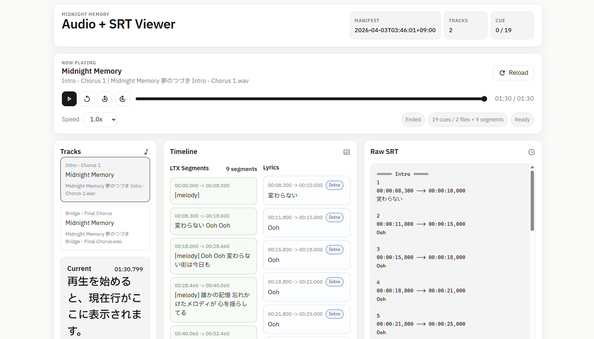

<div align="center">
  
  <h1>midnight-memory</h1>
  <p>Generate lyric-aligned SRT subtitles, split intro/outro subtitle parts, build LTX segment SRTs, and review everything in a local audio viewer.</p>
</div>

<p align="center">
  <a href="./README.ja.md">日本語 README</a>
</p>

<p align="center">
  Visual reference: <a href="https://tokyomidnight.tokiwavalley.com/">Tokyo Midnight</a>
</p>

<p align="center">
  <a href="https://github.com/Sunwood-ai-labs/midnight-memory/actions/workflows/ci.yml"></a>
  
  
  
</p>

## 🧭 Overview

`midnight-memory` is a local-first workflow for song subtitle timing work.

- `scripts/gemini_srt.py` generates lyric-aligned SRT files from WAV audio plus lyric candidates.
- Split subtitle parts such as `intro`, `main`, and `outro` can be registered under `assets/manifest.json`.
- `scripts/segment_ltx_audio.py` generates per-track, gapless `*.ltx_segments.srt` files with melody coverage for LTX lip-sync preparation.
- The viewer renders `Lyrics` and `LTX Segments` in separate synchronized lanes so coarse segment timing does not clutter the lyric cue list.

## ⚡ Quick Start

### Requirements

- Python 3.11+
- [uv](https://github.com/astral-sh/uv)
- `.env` with `GEMINI_API_KEY`

### Setup

```bash
cd D:\midnight-memory
uv sync
```

Copy `.env.example` to `.env`, then set your API key:

```env
GEMINI_API_KEY=YOUR_GEMINI_API_KEY
```

### Generate A Lyric SRT

```bash
uv run python scripts/gemini_srt.py `
  --audio "private-assets/Midnight Memory 夢のつづき  Intro - Chorus 1.wav" `
  --lyrics "private-assets/09 (1).txt" `
  --output "assets/Midnight Memory 夢のつづき  Intro - Chorus 1.main.srt"
```

Use `--allow-extra-text` when short audible fragments should stay in the output even if they are missing from the lyric source.

### Generate LTX Segment SRTs

```bash
uv run python scripts/segment_ltx_audio.py assets --output-dir assets/ltx-segments
```

This command reads the track definitions in `assets/manifest.json`, uses the WAV duration, fills uncovered gaps with `[melody]`, and writes per-track `*.ltx_segments.srt` files.

### Run The Viewer

```bash
cd D:\midnight-memory
uv run python -m http.server 8000
```

Open `http://localhost:8000/` or `http://localhost:8000/viewer/`.

When `timelineSubtitles` is present, the viewer renders lyric cues and LTX segment cues in separate lanes.
On desktop the two lanes are shown side by side; on narrower screens they stack vertically.



## 🗂 Documentation Map

- [docs/index.md](./docs/index.md): English documentation hub and maintenance notes.
- [docs/ja/index.md](./docs/ja/index.md): Japanese documentation hub.
- [docs/intro-outro-subtitle-workflow.md](./docs/intro-outro-subtitle-workflow.md): English intro/outro split subtitle workflow.
- [docs/ja/intro-outro-subtitle-workflow.md](./docs/ja/intro-outro-subtitle-workflow.md): Japanese intro/outro split subtitle workflow.
- [docs/ltx-segment-workflow.md](./docs/ltx-segment-workflow.md): English LTX segment workflow.
- [docs/ja/ltx-segment-workflow.md](./docs/ja/ltx-segment-workflow.md): Japanese LTX segment workflow.

## 🎛 Viewer Manifest

Use `subtitle` for a single subtitle file:

```json
{
  "id": "track-id",
  "audio": "private-assets/Track Name.wav",
  "subtitle": "assets/Track Name.srt"
}
```

Use `subtitles` for split lyric parts:

```json
{
  "id": "track-id",
  "audio": "private-assets/Track Name.wav",
  "subtitles": [
    { "id": "intro", "label": "Intro", "path": "assets/Track Name.intro.srt" },
    { "id": "main", "label": "Main", "path": "assets/Track Name.main.srt" }
  ]
}
```

Use `timelineSubtitles` for companion lanes such as LTX segment review:

```json
{
  "id": "track-id",
  "audio": "private-assets/Track Name.wav",
  "subtitles": [
    { "id": "main", "label": "Main", "path": "assets/Track Name.main.srt" }
  ],
  "timelineSubtitles": [
    { "id": "ltx", "label": "LTX", "path": "assets/ltx-segments/Track Name.ltx_segments.srt" }
  ]
}
```

## ✅ Validation

Run the Python checks:

```bash
uv sync --group dev
uv run pytest
uv run python scripts/validate_manifest.py
```

Run the viewer probes:

```bash
npm install
npx playwright install chromium
uv run python scripts/create_stub_audio.py
npm run test:viewer
```

## 📦 Project Layout

- `scripts/gemini_srt.py`: Gemini-backed subtitle generation CLI.
- `scripts/extract_subtitle_gap.py`: reproducible intro/outro gap extraction helper.
- `scripts/segment_ltx_audio.py`: LTX segment SRT generator with melody coverage.
- `scripts/validate_manifest.py`: manifest validation for local QA and CI.
- `viewer/`: static review UI.
- `docs/`: Markdown documentation for workflows and viewer behavior.
- `assets/*.srt`: lyric subtitle inputs and sample outputs.
- `assets/ltx-segments/*.ltx_segments.srt`: per-track LTX segment outputs.
- `assets/manifest.json`: track registry for the viewer.
- `private-assets/`: local-only audio and lyric sources.

## 📚 Documentation Growth Rules

When adding new docs in the future:

- add the English page under `docs/`
- add the Japanese counterpart under `docs/` or `docs/ja/`
- link the new page from both `docs/index.md` and `docs/ja/index.md`
- update README links when the page becomes part of the main workflow
- keep commands and filenames synchronized across languages

## ⚖️ Content Rights

This repository stays local-first.
Tracked subtitle samples may contain lyric excerpts that are subject to separate rights from the source code and automation scripts, so the repo does not declare a blanket open-source `LICENSE` file.
Treat audio, lyric, and subtitle content as your own responsibility unless you have redistribution rights.

## 📝 Notes

- Never commit `.env` with API keys.
- Keep lyric and subtitle files in UTF-8.
- `private-assets/` is ignored by Git and expected to contain your local audio sources.
